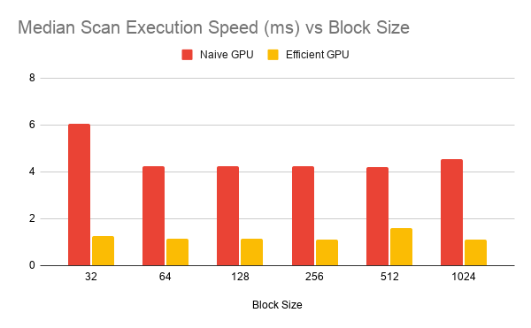
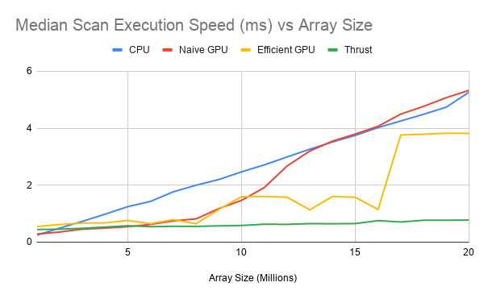
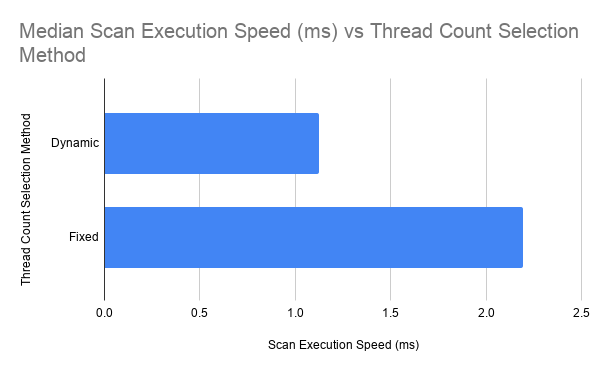

CUDA Stream Compaction
======================

**University of Pennsylvania, CIS 565: GPU Programming and Architecture, Project 2**

* Nathan Chortek
  * [LinkedIn](https://www.linkedin.com/in/nathan-chortek/), [personal website](https://www.nathanchortek.com/)
* Tested on: Windows 11, AMD Ryzen AI 9 HX 370, NVIDIA GeForce RTX 5090 Laptop GPU

## Project description

This project involves implementing stream compaction and scan algorithms using both the CPU and the GPU. The CPU implementation
is used as a baseline to compare the GPU implementations against, and GPU implementations using naive, work-efficient, and Thrust
algorithms are included.

### Features implemented

* Scan, using CPU, naive GPU, work-efficient GPU, and Thrust algorithms
* Compact, using CPU and work-efficient GPU algorithms
* Extra credit: Dynamic thread count selection for the work-efficient GPU scan

## Performance analysis

For GPU implementations, the majority of the work done for stream compaction occurs in the scan implementation, which is what this 
performance analysis focuses on.

### Program parameters

Unless stated otherwise, performance measurements are medians taken from 21 samples, running the program with the following
parameter values:

| Parameter | Value |
|---|---|
| Array size | 2^24^ (~16.8 million) |
| Block size | 256 |

### Device properties and theoretical occupancy

**Device limits** queried via NVIDIA Nsight Compute's Occupancy Calculator:

| Device limit | Value |
|---|---|
| SMs | 82 |
| Warp size | 32 |
| Max threads / SM | 1536 |
| Max blocks / SM | 24 |
| Max warps / SM | 48 |
| 32-bit registers / SM | 65536 |
| Register allocation unit size | 256 |
| Register allocation granularity | warp |

**Theoretical occupancy** for `kernNaiveScan`, `kernUpsweep`, and `kernDownsweep` (16 registers/thread):

| Block size | Warps/block | Allocatable blocks by warp cap | Allocatable blocks by blocks/SM cap | Allocatable blocks by register cap | Active blocks/SM | Active warps/SM | Occupancy | Limiting occupancy factor |
|---|---|---|---|---|---|---|---|---| 
| 32 | 1 | 48 | 24 | 128 | 24 | 24 | 50% | Blocks/SM |
| 64 | 2 | 24 | 24 | 64 | 24 | 48 | 100% | Warps, Blocks/SM |
| 128 | 4 | 12 | 24 | 32 | 12 | 48 | 100% | Warps |
| 256 | 8 | 6 | 24 | 16 | 6 | 48 | 100% | Warps |
| 512 | 16 | 3 | 24 | 8 | 3 | 48 | 100% | Warps |
| 1024 | 32 | 1 | 24 | 4 | 1 | 32 | 67% | Warps |

Derivations:

* Block size: Input
* Warps/block: `blockSize / warpSize = blockSize / 32`
* Allocatable blocks by warp cap: `floor(maxWarpsPerSM / warpsPerBlock) = floor(48 / warpsPerBlock)`
* Allocatable blocks by blocks/SM cap: `maxBlocksPerSM`
* Registers per warp: `registerAllocUnitSize * divup(registersPerThread * warpSize, registerAllocUnitSize) = 256 * divup(16 * 32, 256) = 512`
* Warps by register cap: `floor(maxRegistersPerSM / regsPerWarp) = floor(65536 / 512) = 128`
* Allocatable blocks by register cap: `floor(warpsByRegCap / warpsPerBlock) = floor(128 / warpsPerBlock)`
* Active blocks/SM: `min(blocksByWarpCap, blocksByBlocksPerSMCap, blocksByRegisterCap)`
* Active warps/SM: `activeBlocks * warpsPerBlock`
* Occupancy: `activeWarps / maxWarpsPerSM = activeWarps / 48`
* Limiting occupancy factor: The smallest cap on `activeBlocks`

Shared memory can also bind active blocks/SM, but my kernel implementations do not allocate additional shared memory per block for any
kernels, and the per-block shared memory that CUDA automatically allocates is small enough to never be the limiting occupancy factor.
Similarly, block barriers can also bind active blocks/SM, but my kernel implementations never need to call `__syncthreads()`, so there
are no block barriers here.

### Impact of block size



**Scan execution speed (ms) vs block size**

| Block size | Naive GPU | Efficient GPU |
|---|---|---|
| 32 | 6.0607 | 1.2641 |
| 64 | 4.2524 | 1.1507 |
| 128 | 4.2458 | 1.1583 |
| 256 | 4.2282 | 1.1228 |
| 512 | 4.2171 | 1.5990 |
| 1024 | 4.5293 | 1.1254 |

**Naive GPU scan**

For the naive scan implementation, block sizes 64, 128, 256, and 512 are all roughly comparable, which aligns with the fact that
the theoretical occupancy of `kernNaiveScan` is 100% for those block sizes. Block sizes 32 and 1024 are the outliers, with 32 
having the worst performance, which also aligns with block size 32's 50% theoretical occupancy and block size 1024's 67% theoretical
occupancy. Naive scan's kernel launches each spawn `divup(n, blockSize)` blocks. Given `n` is fixed at 2^24^, all of the device SMs
will be working at every block size, so differences in occupancy will directly affect runtime. However, once occupancy is roughly
maximized (as is the case for block sizes 64-512), memory bandwidth becomes the limiting factor. The naive scan implementation
does O(n log(n)) work regardless of block size and memory throughput should be roughly equal for all block sizes with the same occupancy,
which explains why block sizes 64-512 show flat performance.

**Work-efficient GPU scan**

For the work-efficient scan implementation, `kernUpsweep` and `kernDownsweep` have the same theoretical occupancies as `kernNaiveScan`, 
yet we do not see performance align with occupancy. This makes sense, because `kernUpsweep` and `kernDownsweep` vary the number of
blocks they spawn by a factor of 2 at each launch, so achieved occupancy differs greatly from theoretical occupancy. The work done
by all of the `kernUpsweep` and `kernDownsweep` kernel launches sums to O(n), but because we only spawn the minimum number of blocks
required to perform the `expectedWrites` at a given upsweep/downsweep level, many of those kernel launches will have very low occupancy 
with many SMs remaining completely idle. Block size, then, ceases to meaningfully differentiate performance for the work-efficient scan,
because the high-occupancy invocations are already bound by DRAM throughput, and the low-occupancy invocations are dominated by fixed 
per-launch overhead. Looking at the data, block size 512 does seem to perform the worst for the work-efficient scan, but this is likely 
due to measurement variance: when I retroactively reran data collection for block size 512 a handful of times, measurements ranged from 
1.11 to 1.17 ms. The initial 1.599 ms value in the table above is preserved because that measurement was taken at the same time as the 
other block size measurements, and I wanted to keep methodology and device state consistent for data in the formal tables and graphs.

**Chosen block size**

For the sections to follow, block size 256 is used for all test cases, because it has 100% theoretical occupancy for both GPU scan
implementations without being associated with an outlying measurement (unlike block size 512).

### Impact of array size



**Scan execution speed (ms) vs array size**

| Array size | CPU | Naive GPU | Efficient GPU | Thrust |
|---|---|---|---|---|
| 1,000,000 | 0.2431 | 0.2833 | 0.5494 | 0.4434 |
| 2,000,000 | 0.4902 | 0.3542 | 0.6179 | 0.4545 |
| 3,000,000 | 0.7277 | 0.4563 | 0.6688 | 0.4847 |
| 4,000,000 | 0.9800 | 0.4927 | 0.6759 | 0.5289 |
| 5,000,000 | 1.2453 | 0.5415 | 0.7614 | 0.5758 |
| 6,000,000 | 1.4289 | 0.6214 | 0.6478 | 0.5435 |
| 7,000,000 | 1.7660 | 0.7462 | 0.7905 | 0.5558 |
| 8,000,000 | 1.9972 | 0.8161 | 0.6442 | 0.5535 |
| 9,000,000 | 2.1969 | 1.1761 | 1.1462 | 0.5705 |
| 10,000,000 | 2.4653 | 1.4653 | 1.5955 | 0.5843 |
| 11,000,000 | 2.7112 | 1.9148 | 1.6036 | 0.6290 |
| 12,000,000 | 2.9876 | 2.6709 | 1.5772 | 0.6239 |
| 13,000,000 | 3.2616 | 3.1963 | 1.1342 | 0.6496 |
| 14,000,000 | 3.5149 | 3.5443 | 1.6034 | 0.6449 |
| 15,000,000 | 3.7458 | 3.7929 | 1.5740 | 0.6514 |
| 16,000,000 | 4.0200 | 4.0636 | 1.1469 | 0.7540 |
| 17,000,000 | 4.2520 | 4.4935 | 3.7604 | 0.7074 |
| 18,000,000 | 4.4856 | 4.7638 | 3.7870 | 0.7683 |
| 19,000,000 | 4.7373 | 5.0695 | 3.8216 | 0.7691 |
| 20,000,000 | 5.2630 | 5.3275 | 3.8172 | 0.7754 |

**Naive GPU scan**

The naive gpu scan implementation is faster than the cpu scan implementation for array sizes ranging from 2 million to 13 million, with
the performance gap being largest at array size 8 million, where the naive scan's execution time is 2.45× lower. At array sizes below 2
million and above 13 million, the naive GPU scan is actually slower than the CPU scan. Examining `kernNaiveScan` in NVIDIA Nsight Compute
helps explain why this is happening: compute throughput is relatively flat at ~25% for array sizes 1 million, 8 million, and 17 million,
but DRAM throughput rises to ~57%, ~95%, and ~100% respectively (and is consistently higher than the L1 and L2 cache throughputs). This 
indicates that the performance bottleneck is DRAM throughput. Past array size 8 million, memory is fully saturated as we hit our memory 
bandwidth limit. Since memory is the bottleneck, the only way to improve performance is to move less data through fewer global memory 
accesses (`kernNaiveScan` already accesses contiguous memory within a given warp, so coalescing already occurs). Understanding why 
reaching memory saturation also coincides with the performance gap between CPU scan and `kernNaiveScan` closing comes down to how the 
total amount of memory transferred scales relative to array size. The naive gpu scan launches `kernNaiveScan` log(n) times, and each 
kernel invocation has to load all `n` elements in the array from global memory, meaning total memory transfer scales at roughly 
O(n log(n)). The CPU scan only needs to access each of the `n` elements in the array a single time, so it scales much better at O(n). 
This difference in complexity explains why the CPU scan actually scales better than `kernNaiveScan` for unbounded array size growth.

**Work-efficient GPU scan**

The work-efficient gpu scan implementation is faster than the cpu scan implementation for array sizes 3 million and above. That makes 
sense because the total work performed is O(n), just like the cpu scan, but the work-efficient gpu implementation is able to parallelize 
a lot of that work: most of the work happens in early `kernUpsweep` invocations and late `kernDownsweep` invocations. Examining the 
work-efficient scan in NVIDIA Nsight Compute backs this up. At array size 17 million, the first `kernUpsweep` invocation launches 65,536 
blocks, runs for 335 µs at ~100% DRAM throughput, and reaches 80.69% achieved occupancy, meaning it is DRAM throughput bound in the same 
way `kernNaiveScan` is. The final `kernUpsweep` invocation launches a single block, reaches only 4.97% achieved occupancy, and is flagged 
by Nsight Compute as a "Small Grid" with 0.00 full waves across all SMs. The same pattern holds at array sizes 1 million (78.3% down to 
6.09% achieved occupancy) and 8 million (79.1% down to 5.37% achieved occupancy). For these low-work invocations, per-launch overhead 
dominates: invocation duration flattens out at roughly 4 µs and stays there whether the invocation launches 8 blocks or 1. Their share of 
total runtime is low enough that the parallelized work of the high-work invocations still allows consistently better performance than the 
cpu scan. The ladder shape in the graph above comes from padding array sizes up to the next power of two. Because `paddedLen = 1 << ilog2ceil(n)`,
every array size in the range (2^23^, 2^24^] performs identical work, so runtime is roughly constant with some run-to-run variance within 
a plateau, spiking sharply at each boundary.

The work-efficient gpu scan is also slower than the naive gpu scan until around array size 8 million. The per-launch overhead of the 
low-work invocations is a roughly fixed cost of about 100-130 µs at every array size, while the work done by the high-work invocations 
grows with array size, so that overhead only becomes negligible once the array is large enough. The naive gpu scan pays no such cost, 
because every `kernNaiveScan` invocation launches `divup(n, blockSize)` blocks and saturates the device regardless of array size, causing
`kernNaiveScan` to outperform the work-efficient gpu scan until the array becomes large enough for the per-launch overhead to be outweighed
by the efficiency gains from high-work invocations of `kernUpsweep` and `kernDownsweep`.

**Thrust scan**

Thrust's scan performance beats all other implementations for all array sizes larger than 5 million, with its performance exhibiting O(n) 
scaling with very shallow slope, and again NVIDIA Nsight Compute hints at some answers. First, the Thrust scan launches exactly 3 kernels
(`static_kernel`, `DeviceScanInitKernel`, and `DeviceScanKernel`) for all array sizes, which keeps per-launch overhead a fixed cost that 
becomes negligible as array size grows. Second, the number of threads spawned by `DeviceScanInitKernel` follows a 1:1 ratio with the number 
of blocks spawned by `DeviceScanKernel`, which suggests that `DeviceScanInitKernel` is doing some sort of per-block state initialization 
to allow each `DeviceScanKernel` block to do a larger amount of work. This is also backed up by `DeviceScanKernel` using 66 registers; far 
more than the 16 registers used by `kernNaiveScan`, `kernUpsweep`, and `kernDownsweep`. Additionally, memory throughput for `DeviceScanKernel` 
rises with array size: 38.33% at 1 million, 81.15% at 8 million, and 94.80% at 17 million. Interestingly, at array size 1 million, the 
Thrust scan actually loses to the CPU scan (0.4434 vs 0.2431 ms), presumably due to kernel launch overhead outweighing the gains from 
parallelization before memory throughput becomes saturated at higher array sizes.

### (Extra credit) Varying thread count per invocation of `kernUpsweep` and `kernDownsweep`



**Scan execution speed (ms) vs thread count selection method**

| Thread count | Scan execution speed (ms) |
|---|---|
| Dynamic | 1.1228 |
| Fixed | 2.1928 |

The work-efficient GPU scan implementation launches `kernUpsweep` and `kernDownsweep` kernels with the minimum number of blocks required
to perform the required number of writes for a given layer, rather than spawning a fixed number of blocks that covers all `n` elements of 
the input array. For dynamic thread count selection, this means launching with `divup(expectedWrites, blockSize)` blocks. For fixed thread
count selection, this means launching with `divup(paddedLen, blockSize)` blocks. While the amount of memory transferred for each selection 
method is the same due to threads early-returning when their index doesn't have any work to perform, the dynamic method reduces the number 
of blocks that must be scheduled and retired per launch. Given the high number of kernel launches performed by the work-efficient GPU scan 
implementation (`2 * log(n)`), this is particularly impactful, resulting in a 1.95× lower execution time when using the dynamic method.

### Test program output

I refactored the test harness to separate correctness tests from timing measurements, and I added a correctness test to cover cpu 
compact with scan for the non-power-of-two case. The following uses array size `1<<24` and 21 samples per implementation for the 
timing measurements:

```
****************************
** SCAN CORRECTNESS TESTS **
****************************

    [  12   5  19   7   1  23   9  42   5   2   4   2  36 ...  45   0 ]
==== cpu scan, power-of-two ====
    [   0  12  17  36  43  44  67  76 118 123 125 129 131 ... 410973156 410973201 ]
==== cpu scan, non-power-of-two ====
    [   0  12  17  36  43  44  67  76 118 123 125 129 131 ... 410973081 410973084 ]
    passed
==== naive scan, power-of-two ====
    passed
==== naive scan, non-power-of-two ====
    passed
==== work-efficient scan, power-of-two ====
    passed
==== work-efficient scan, non-power-of-two ====
    passed
==== thrust scan, power-of-two ====
    passed
==== thrust scan, non-power-of-two ====
    passed

*****************************************
** STREAM COMPACTION CORRECTNESS TESTS **
*****************************************

    [   1   3   1   2   2   0   3   3   1   2   2   2   3 ...   1   0 ]
==== cpu compact without scan, power-of-two ====
    [   1   3   1   2   2   3   3   1   2   2   2   3   3 ...   2   1 ]
    passed
==== cpu compact without scan, non-power-of-two ====
    [   1   3   1   2   2   3   3   1   2   2   2   3   3 ...   1   3 ]
    passed
==== cpu compact with scan, power-of-two ====
    [   1   3   1   2   2   3   3   1   2   2   2   3   3 ...   2   1 ]
    passed
==== cpu compact with scan, non-power-of-two ====
    [   1   3   1   2   2   3   3   1   2   2   2   3   3 ...   1   3 ]
    passed
==== work-efficient compact, power-of-two ====
    passed
==== work-efficient compact, non-power-of-two ====
    passed

******************
** TIMING TESTS **
******************


test                                                                median (ms)     min (ms)     max (ms)
cpu scan, power-of-two (std::chrono Measured)                            4.2839       4.0148       4.5159
cpu scan, non-power-of-two (std::chrono Measured)                        4.3160       4.0253       4.5671
naive scan, power-of-two (CUDA Measured)                                 4.2928       4.2765       4.9660
naive scan, non-power-of-two (CUDA Measured)                             4.2959       4.2686       4.6239
work-efficient scan, power-of-two (CUDA Measured)                        1.1470       0.9710       1.2653
work-efficient scan, non-power-of-two (CUDA Measured)                    1.1255       1.0297       1.3427
thrust scan, power-of-two (CUDA Measured)                                0.6984       0.6519       1.2409
thrust scan, non-power-of-two (CUDA Measured)                            0.7596       0.6516       1.1992
cpu compact without scan, power-of-two (std::chrono Measured)           29.0439      27.9769      29.8352
cpu compact without scan, non-power-of-two (std::chrono Measured)       28.9770      28.0755      29.9111
cpu compact with scan, power-of-two (std::chrono Measured)              34.3886      33.9140      35.4544
cpu compact with scan, non-power-of-two (std::chrono Measured)          34.5398      33.8304      35.3726
work-efficient compact, power-of-two (CUDA Measured)                     2.0075       1.8661       2.7829
work-efficient compact, non-power-of-two (CUDA Measured)                 1.9876       1.8943       2.6611
```
